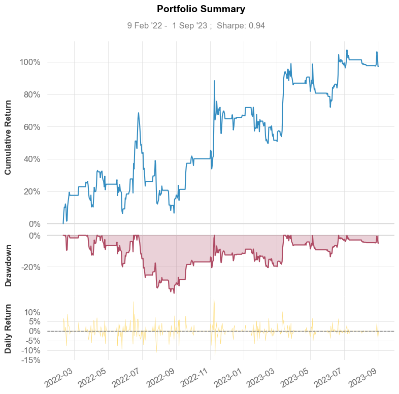

# Time Series Project (Please use some other title)
Wei Yuan, Chen Zhao, Erding Liao

### 1. Mathematical Logics \& Assumptions
> We scrutinized the performance of three distinct financial indicators: the Long-Short Ratio, the Bias Indicator, and the Price-Volume Correlation. For each indicator, we also used z-score and position data to formulate a linear combination representing the factor. This methodical approach enabled us to construct portfolios that encapsulate the multifaceted nature of each indicator. To evaluate the efficacy and robustness of these portfolios, we employed backtesting using data from March 2022 to September 2023, which provides a pivotal time phase in assessing their historical performance and potential future predictive power in the dynamic landscape of cryptocurrency.
>
> #### 1.1 Long-short Ratio
>> The long-short ratio is used to show the value of short sales taking place for a basket of assets or for the market as a whole. It represents the amount of assets that are currently available for short sale compared to the amount that is actually sold short, with its mathematical formulation:
>>- Long Account ($LA$) $=$ Accounts with net long positions / Total Accounts with positions
>>- Short Account ($SA$) $=$ Accounts with net short positions / Total Accounts with positions
>>- Long-short Ratio $=$ $\frac{LA}{SA}$
>> #### Assumptions
>> The athematical formulation of Long-short is grounded in several fundamental assumptions that reflect market dynamics, participants’ behavior, and the informational efficiency of the marketplace:
>> - <strong>Homogeneity of Market Influence:</strong> The LSR assumes a democratic distribution of influence among market participants. By assigning equal weight to each account, regardless of the size or volume of trades, the ratio suggests a 'one account, one vote' principle. In reality, the financial clout and strategic moves of larger accounts can disproportionately sway market prices, a factor the LSR's simple arithmetic does not capture. The assumption of homogeneity implies a level playing field that may not exist, especially in markets where institutional investors participate alongside retail traders. 
>> - <strong>Market Inefficiencies:</strong> The LSR is based on the notion that markets are not fully efficient and that sentiment can be a leading indicator before information is fully absorbed into prices. It operates on the concept that discrepancies between the LSR and actual market prices can exist and that these discrepancies can be exploited for trading gains. In an entirely efficient market, the ratio would be of little use as prices would instantaneously reflect all available information, including the sentiments and positions of all market participants.
>> - <strong>Stability and Predictive Power of Sentiment:</strong> The foundational premise of the LSR is its stability and predictive power over market trends. The ratio posits that prevailing sentiment, as encapsulated by the LSR, can reliably forecast future price movements. This is a significant assumption, particularly in the realm of high-frequency trading where sentiment can fluctuate rapidly and unpredictably, often influenced by extraneous factors beyond the scope of the ratio's computation.
>
> #### 1.2 Bias index
>>The 'Bias' indicator, as described, represents the difference between a short-term moving average and a long-term moving average of cryptocurrency closing prices. The primary logic of the Bias indicator is to identify and follow trends. The assumption is that if the short-term average is above the long-term average, the market is in an uptrend, and vice versa then for a downtrend. Unlike the long/short ratio, the Bias indicator focuses on price momentum and trend identification. By subtracting the long-term moving average from the short-term moving average, the Bias indicator reflects the momentum or the speed of price change. A widening gap suggests increasing momentum, while a narrowing gap indicates decreasing momentum.
>>
>> The most importantly, Bias indicator embodies the concept of mean reversion. When the price deviates significantly from the long-term average, it may signal an overextended market that could revert to its mean or average level.
>>
>> Therefore, we must assume that markets react to new information gradually, allowing the moving averages to capture these reactions over time. Collective actions of market participants have an inherent tendency to persist over time. This assumption extends to the belief that trends, once established, are more likely than normal momentum to continue. In the formulation of the Bias, the short-term moving average is viewed as a dynamic threshold that adapts to recent price action, while the long-term average serves as a benchmark or anchor that embodies more substantial historical sentiment and market equilibrium. The indicator thus leverages this dichotomy, mathematically capturing the essence of market momentum and its propensity to sustain established directional moves.
>
> #### 1.3 PV Correlation
>> The Price-Volume (PV) Correlation indicator is a statistical measure that quantifies the degree of association between a cryptocurrency's closing prices (Price) and its trading volume (Volume). Mathematically, the correlation coefficient $\sigma(P,V)$ is used to represent this relationship.
>> 
>> Therefore, as we are using correlation $\sigma$ as a reference to the indicator objective, we must assume that trading volume acts as a corroborating factor for the strength and direction of price trends, and correlation directly maps to this causality.

### 2. Data
> Our main data source is from [Binance Data Collection](https://data.binance.vision/). We focused in 1-minute high-frequency as in the case of cryptocurrency and parse them into np.memmap for effective processing. Please note that we are not providing original data in our submitted codes due to the extreme data size, but one can refer to [data_reader.py](data_reader.py) for more information

### 3. Backtest
> We backtested linear models for each factor using the aforementioned data. All plots are displayed below, and for more detailed data and performance metrics, please refer to our Jupyter Notebook
> #### 3.1 Long-short Ratio
> 
>  | 
> --- | ---
>> The long-short ratio strategy displayed a Sharpe ratio of 0.98, which is close to the ideal benchmark of 1. This metric indicates that the strategy was able to deliver near-unit excess return for each unit of risk taken. Given the often volatile nature of cryptocurrency markets, achieving a Sharpe ratio near 1 is commendable and suggests that the strategy effectively managed the trade-off between risk and return.
>> When considering the replication of past results, the strategy showed periods of consistent performance, as indicated by the relatively smooth cumulative return curve in the earlier provided plot. This indicates that the strategy, once successful, was able to repeatedly capitalize on the market conditions it was designed to exploit, a positive sign for its replicability.
> #### 3.2 Bias indicator
>  | 
> --- | ---
>> The Bias indicator excels in identifying market trends. A positive and increasing Bias value indicates a strengthening bullish trend, and vice versa for a bearish trend. Over the observed period, the indicator has facilitated the capitalization on sustained price movements, contributing to the $97.18\%$ cumulative return and a CAGR of $35.15\%$. The Sharpe ratio of $0.94$, although slightly lower than the Long/Short Ratio strategy, still indicates a solid risk-adjusted return. The Positive Sharpe Ratio Probability of $92.46\%$ provides confidence in the consistency of the strategy's risk-adjusted performance.
>> 
>> However, as with all indicators based on moving averages, the Bias is inherently a lagging indicator. It relies on past data to provide a signal, which means that it can be slow to indicate reversals or sudden market shifts, as evidenced by the significant maximum drawdown of $-36.8\%$.
> #### 3.3 PV Correlation
>  | 
> --- | ---
>> The PV Correlation captures the synergy between price movements and volume, which is a cornerstone of market conviction. A positive correlation typically implies that price increases are supported by increased volume, suggesting a strong market consensus. This has likely contributed to the high cumulative return of $293.4\%$ and a Compound Annual Growth Rate (CAGR) of $83.61\%$, indicating that the strategy effectively capitalized on periods when price movements were validated by volume data.
>>
>> The Sharpe ratio of $1.67$ is indicative of an excellent risk-adjusted return, which means the portfolio has provided a high return per unit of risk taken. This is bolstered by the high Probability Sharpe Ratio of $99.6\%$, suggesting a high level of confidence in the strategy’s performance.
>>
>>
